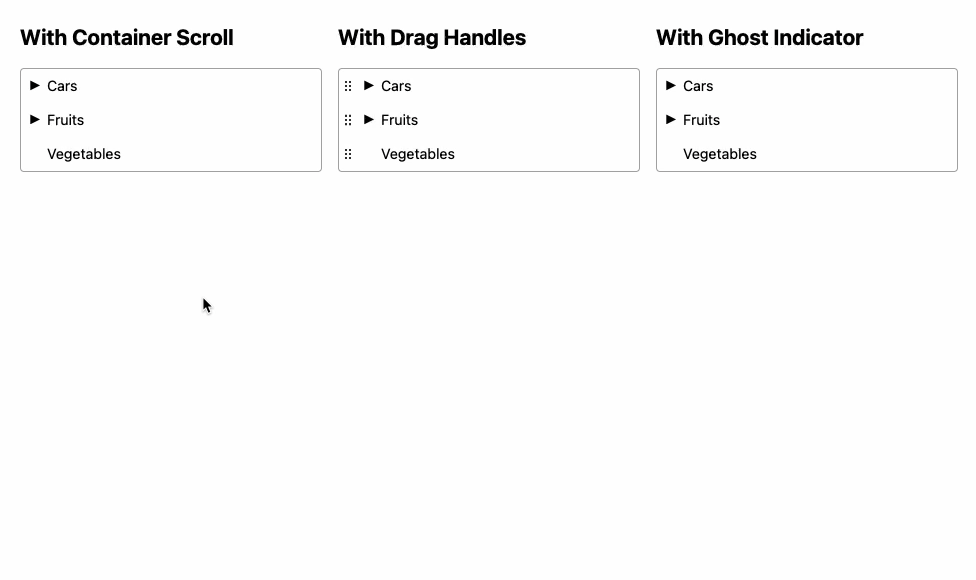

<div align="center">
<h1>pragmatic-drag-and-drop-tree 🏝️</h1>

<p>A headless drag-and-drop tree component for React built with <a href="https://github.com/atlassian/pragmatic-drag-and-drop">pragmatic-drag-and-drop</a>.</p>
</div>

---

[![version][version-badge]][package]
[![downloads][downloads-badge]][npmtrends]

> **Warning**
> This library is in early development and may not be production ready. Please give it a try and provide your feedback in the issues.



## The problem

Pragmatic drag and drop is an excellent library for building drag and drop interfaces, and although it has native support for tree structures, it requires a lot of boilerplate code to implement and many of the provided examples make use of Atlassian's Atlaskit design system which may not always be desirable. The base components also lack some needed features, such as [drag restrictions](https://github.com/atlassian/pragmatic-drag-and-drop/issues/49).

## This solution

This library provides a React wrapper component that works out-of-the-box with minimal configuration, provides examples for common use cases, and allows aims to be headless so that it can be styled using your favorite CSS or CSS-in-JS library.

## Table of Contents

- [Installation](#installation)
- [Usage](#usage)
  - [Props](#props)
  - [Examples](#examples)
  - [Known Issues](#known-issues)
- [Other Solutions](#other-solutions)
- [Issues](#issues)
  - [🐛 Bugs](#-bugs)
  - [💡 Feature Requests](#-feature-requests)
- [Contributors ✨](#contributors-)
- [LICENSE](#license)

## Installation

This module is distributed via [npm][npm] which is bundled with [bun][bun] and
should be installed as one of your project's `dependencies`:

```
npm install pragmatic-drag-and-drop-tree
```

## Usage

```tsx
import SortableTree from 'pragmatic-drag-and-drop-tree';

const data = [
  {
    data: {anything: 'you want here'},
    id: '1',
    items: [
        {
            id: '1a',
            data: {anything: 'you want here'},
        }
    ]
  },
  {
    data: {anything: 'you want here'},
    id: '2'
  }
];

const SomeComponent = () => (
  <SortableTree
    items={items}
    onDrop={({instruction, source, target}) => {
        // Update your tree data here in local state, or send a request to your backend API
    }}
    onExpandToggle={({isOpen, item}) => {
        // Mutate your `items` data state here to set an `isOpen` property
    }}
    renderRow={({item}) => <div>{item.id}</div>}
  >
    {({ children, containerRef }) => (
      <ol ref={containerRef}>
        {children}
      </ol>
    )}
  </SortableTree>
);
```

## Props

### children

> `(childProps: ChildPropsType) => React.ReactNode` | no default

Children must be passed as a function which will receive a `childProps` object with the following properties:

- `children`: The tree rows themselves.
- `containerRef`: A ref object which should be applied to the container DOM element.

We recommend rendering a `<ul>` or `<ol>` element here and applying the `containerRef` to it.

### flashClass

> `string` | optional, no default

A class name to apply to the dropped item immediately after it is dropped. This is essentially a customizable version of the `triggerPostMoveFlash` function from the `pragmatic-drag-and-drop` library.

### getAllowedDropInstructions

> `(payload: {source, target}) => Array<Instruction['type']>` | optional, no default

A function that returns an array of allowed drop instructions based on which item is being dragged and where it is being dropped to. This allows you to restrict the types of drop operations that are allowed. For example, maybe you are creating a tree of folders and files and only want to allow users to drop into folders.

Acceptable return values are:

- `null`: Allow all drop instructions.
- `[]`: Allow no drop instructions.
- `['reorder-above', 'reorder-below', 'make-child', 'reparent']`: Explicitly allow specific drop instructions.

The available instruction types are:

- `reorder-above`: Allow dropping above the target item.
- `reorder-below`: Allow dropping below the target item.
- `make-child`: Allow dropping into the target item to make it a child.
- `reparent`: A rare situation used only when the last item in a parent needs to be moved down a level without changing its order global position

### indentSize

> `number` | optional, default is `16`

The size of each indentation level in pixels.

### indicatorType

> `'ghost' | 'line'` | optional, default is `'line'`

The type of drop indicator to use. `line` is what `pragmatic-drag-and-drop` uses by default. `ghost` is a custom implementation which shows a ghosted version of the item that is being dragged.

### items

> `Array<ItemType>` | required

An array of items to display in the tree. Each item must have an `id` and `data` property. The `data` property is an object which can contain any additional metadata you want to store with the item.

Additionally, each item can have the following optional properties:

- `isDraggable`: Whether the item is draggable.
- `isOpen`: Whether the item is open to show its children.
- `items`: An array of child items.

### onDrop

> `(payload: DropPayloadType) => void` | optional, no default

A function that is called when an item is dropped. The payload contains the `source` and `target` items, as well as the `   instruction` that was used to move the item.

### onExpandToggle

> `(payload: {item, isOpen}) => void` | optional, no default

A function that is called when an item is expanded or collapsed. The payload contains the `item` and the `isOpen` state. You should use this to update the `items` data state to set the `isOpen` property for the item.

### renderIndicator

> `(indicatorProps: IndicatorPropsType) => React.ReactNode` | optional, no default

A function that is called to render the drop indicator. The payload contains the `instruction` and the `indentLevel` and `indentSize` of the target item. See the `examples` folder for examples of how to implement these.

### renderPreview

> `(previewProps: PreviewPropsType) => React.ReactNode` | optional, no default

A function that is called to render the preview of the item that is being dragged (next to the mouse cursor). The payload contains the `item`. See the `examples` folder for examples of how to implement these.

### renderRow

> `(rowProps: RowPropsType) => React.ReactNode` | optional, no default

A function that is called to render the row of the item. The payload contains several important properties which must be passed down to your child components. See the `examples` folder for examples of how to implement these.

The `rowProps` object contains the following properties:

- `aria-controls`: The ID of the element that controls the row.
- `aria-expanded`: Whether the row is expanded.
- `draggedItem`: The item that is being dragged.
- `dragHandleRef`: A ref object which should be applied to the drag handle DOM element (if you want to use a drag handle). If you want users to drag the entire row, you can ignore this prop.
- `instruction`: The instruction that is being used to move the item.
- `item`: The row item that is being rendered.
- `itemRef`: A ref object which should be applied to the row item DOM element.
- `onExpandToggle`: A function that is called when the row is expanded or collapsed. Attach this to the element you want users to click to toggle expanding/collapsing the tree.
- `state`: The current state of the drag-and-drop operation.

### Examples

You can check the working examples in the `/examples` folder.

To run the examples, check out this repositotyr, run `bun i` to install dependencies, and then running `bun dev` to start a local server.

### Known Issues

- None known yet. Feel free to open an issue.

## Other Solutions

- Use the official `pragmatic-drag-and-drop` library documentation for building tree components ([link](https://atlassian.design/components/pragmatic-drag-and-drop/examples#tree))

## Issues

_Looking to contribute? Look for the [Good First Issue][good-first-issue]
label._

### 🐛 Bugs

Please file an issue for bugs, missing documentation, or unexpected behavior.

[**See Bugs**][bugs]

### 💡 Feature Requests

Please file an issue to suggest new features. Vote on feature requests by adding
a 👍. This helps maintainers prioritize what to work on.

[**See Feature Requests**][enhancements]

## Contributors ✨

Thanks goes to these people:

<table>
  <tbody>
    <tr>
      <td align="center"><a href="https://haus.gg"><br /><sub><b>Ev Haus</b></sub></a></td>
    </tr>
  </tbody>
</table>

## License

MIT

> [!WARNING]
> `pragmatic-drag-and-drop` is licensed under the [Apache 2.0 license](https://github.com/atlassian/pragmatic-drag-and-drop/blob/main/LICENSE).

[npm]: https://www.npmjs.com
[bun]: https://bun.sh
[package]: https://www.npmjs.com/package/pragmatic-drag-and-drop-tree
[npmtrends]: https://www.npmtrends.com/pragmatic-drag-and-drop-tree
[version-badge]: https://img.shields.io/npm/v/pragmatic-drag-and-drop-tree.svg?style=flat-square
[downloads-badge]: https://img.shields.io/npm/dm/pragmatic-drag-and-drop-tree.svg?style=flat-square
[bugs]: https://github.com/EvHaus/pragmatic-drag-and-drop-tree/issues?q=is%3Aopen+is%3Aissue+label%3Abug
[enhancements]: https://github.com/EvHaus/pragmatic-drag-and-drop-tree/issues?q=is%3Aopen+is%3Aissue+label%3Aenhancement
[good-first-issue]: https://github.com/EvHaus/pragmatic-drag-and-drop-tree/issues?q=is%3Aopen+is%3Aissue+label%3A%22good+first+issue%22
